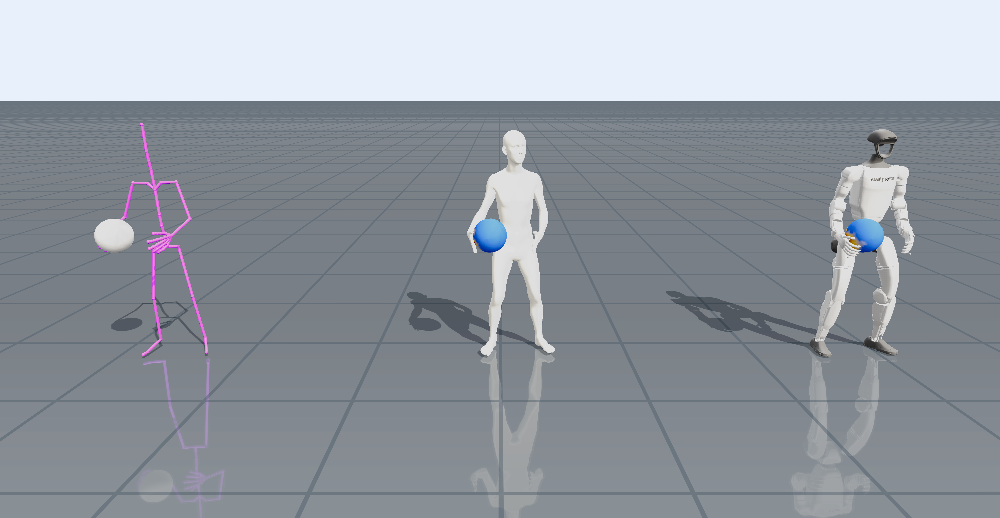
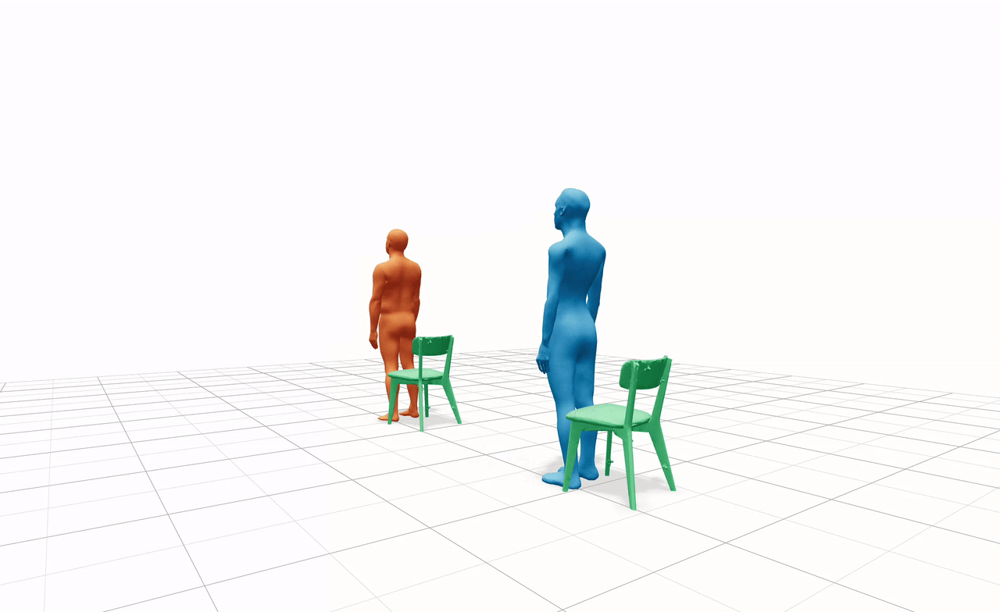
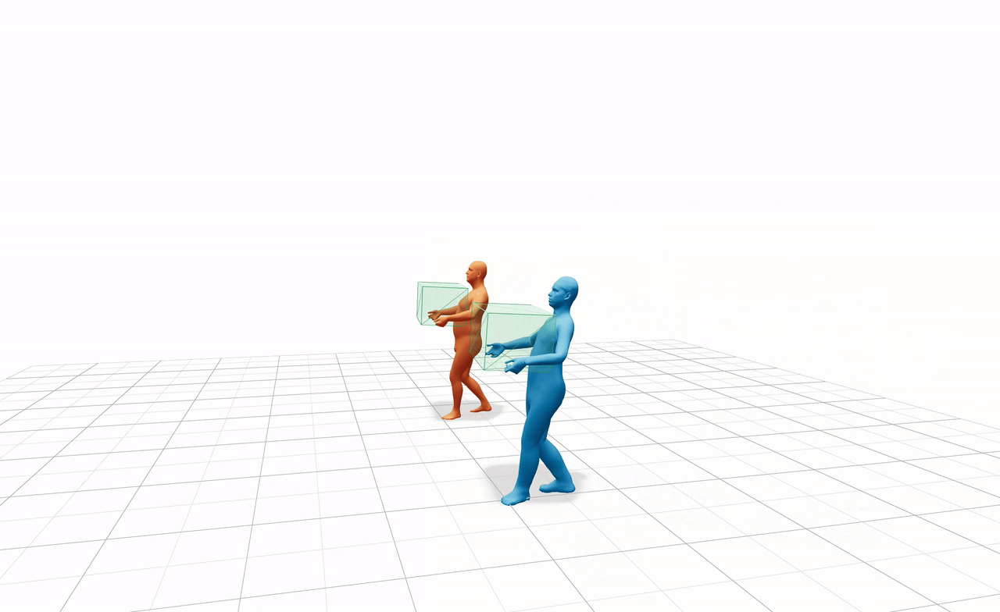

# hiphi2smplx



`hiphi2smplx` converts [HiPHI](https://noitom-robotics.github.io/hiphi/)
actor BVH motion into SMPL-X body parameters. 
The converted SMPL-X motion can be used in downstream tasks such as [UMR](https://github.com/hanyang9/UMR)-based humanoid retargeting.
`hiphi2smplx` is the official tool used in [HiPHI](https://noitom-robotics.github.io/hiphi/) and [UMR](https://github.com/hanyang9/UMR).

The current release supports the conversion between the HiPHI BVH skeleton and the 22 SMPL-X
body joints. Face, eye, and finger poses are not fitted. The codebase is designed to remain extensible: support for a new BVH skeleton is added as a
separate named semantic map instead of broadening the HiPHI mapping with joint
aliases.

## Installation

Python 3.10 or newer is required.

```bash
cd hiphi2smplx
python -m venv .venv
source .venv/bin/activate
python -m pip install --upgrade pip
python -m pip install -e .
```

The default quadratic-programming backend is DAQP. Another backend supported
by `qpsolvers` can be selected with `--qp-solver` when installed in the same
environment.

### Download model files

Model files and pose-prior data are not distributed with this repository.
Download them separately and follow the terms of their respective licenses.

1. Download the SMPL-X model from the
   [official SMPL-X website](https://smpl-x.is.tue.mpg.de/) after registering
   and accepting its license. This converter expects the NPZ neutral model,
   normally named `SMPLX_NEUTRAL.npz`.
2. Beta fitting additionally requires `neutral_smpl_mean_params.h5` and
   `gmm_08.pkl`. The mean parameters are available through the
   [HMR model setup](https://github.com/akanazawa/hmr/blob/master/doc/train.md),
   and the GMM pose prior is part of the registered
   [SMPLify](https://smplify.is.tue.mpg.de/) resources.

One possible local layout is:

```text
assets/
  models/
    SMPLX_NEUTRAL.npz
  beta_fit/
    neutral_smpl_mean_params.h5
    gmm_08.pkl
```

## Quick Start

Fit the first-frame body shape and convert one HiPHI BVH file:

```bash
hiphi2smplx \
  --input-bvh /path/to/motion_actor.bvh \
  --output /path/to/motion_actor_smplx.npz \
  --model-path assets/models/SMPLX_NEUTRAL.npz \
  --fit-betas \
  --beta-fit-data assets/beta_fit \
  --beta-device cuda:0 \
  --progress
```

Beta fitting uses CUDA by default. Use `--beta-device cpu` when no CUDA device
is available.

To reuse an existing SMPL-X shape instead of fitting it again, pass an NPY or
NPZ file containing at least 10 finite beta coefficients:

```bash
hiphi2smplx \
  --input-bvh /path/to/motion_actor.bvh \
  --output /path/to/motion_actor_smplx.npz \
  --model-path assets/models/SMPLX_NEUTRAL.npz \
  --betas /path/to/betas.npy \
  --progress
```

The output is an AMASS-style NPZ containing `poses` with shape `(frames, 165)`,
`trans`, `betas`, `gender`, and `mocap_framerate`. The SMPL-X pose layout is
kept intact, while jaw, eye, and finger rotations remain zero.

## Adding another BVH skeleton

HiPHI uses the `hiphi` map in
`hiphi2smplx.skeleton.SOURCE_SKELETON_MAPS`. To support another BVH hierarchy,
add a new semantic-to-joint-name map under a new key. The converter validates every required mapped joint before fitting.

## Beyond SMPL-X: Higher-Precision Body Meshes

BVH joints do not fully determine body shape, so beta-fitted SMPL-X can mismatch the actor and penetrate scene objects. **We produce our own scan-derived, high-resolution SOMA body meshes to better capture the actors' shapes, and compare them with SMPL-X using the same motions and object trajectories.** Values are reported as **SMPL-X / SOMA** and **mean / maximum**; the metrics are surface ratio, penetration depth (mm), and a depth-integrated volume proxy (cm³), where lower is better.

| Chair | Box |
| --- | --- |
| [](assets/chair.webm) | [](assets/box.webm) |
| **Penetrating surface ratio (%)**<br>SMPL-X: `17.33 / 34.38`; SOMA: `7.99 / 17.19`<br><br>**Depth (mm)**<br>SMPL-X: `26.36 / 89.54`; SOMA: `19.13 / 66.62`<br><br>**Volume proxy (cm³)**<br>SMPL-X: `4384 / 8055`; SOMA: `1467 / 3054` | **Penetrating surface ratio (%)**<br>SMPL-X: `4.38 / 9.38`; SOMA: `2.49 / 6.25`<br><br>**Depth (mm)**<br>SMPL-X: `14.94 / 67.06`; SOMA: `10.15 / 39.51`<br><br>**Volume proxy (cm³)**<br>SMPL-X: `1090 / 2714`; SOMA: `422 / 1101` |

Values are reported as mean / maximum over the sampled action interval.

## Citation

If you used this tool in your project, please cite the following references.

### [HiPHI](https://arxiv.org/abs/2608.16222)

```bibtex
@article{ji2026hiphi,
  title={HiPHI: A Large-Scale Benchmark for High-Precision Human Motion and Object-Interaction},
  author={Ji, Jiahao and Ma, Ji and Zhang, Runhan and Yu, Runyi and Wang, Wenjia and Chi, Weiheng and Peng, Qianqian and Yan, Weichao and Gu, Yongfei and Tian, Ye and Wu, Ting and Li, Longwei and Yuan, Chun and Dai, Ruoli and Han, Lei},
  journal={arXiv preprint arXiv:2608.16222},
  year={2026}
}
```

### [UMR](https://arxiv.org/abs/2609.02134)

```bibtex
@misc{cao2026unifiedmotionretargetinghumanoids,
  title={Unified Motion Retargeting for Humanoids with Learned Point Cloud Correspondence},
  author={Hanyang Cao and Yuetong Fang and Taesoo Kwon and Runyi Yu and Ji Ma and Jing Tan and Yangchen Zhou and Baoze Du and Yi Gu and Yukang Gao and Ruoli Dai and Lei Han and Renjing Xu},
  year={2026},
  eprint={2609.02134},
  archivePrefix={arXiv},
  primaryClass={cs.RO},
  url={https://arxiv.org/abs/2609.02134},
}
```

## References

We indicate externally borrowed code and model components here:

- Beta fitting is adapted from [joint2smpl](https://github.com/wangsen1312/joints2smpl) and [VIBE](https://github.com/mkocabas/VIBE).
- The SMPL-X body model and layer are provided by [SMPL-X](https://github.com/vchoutas/smplx).
